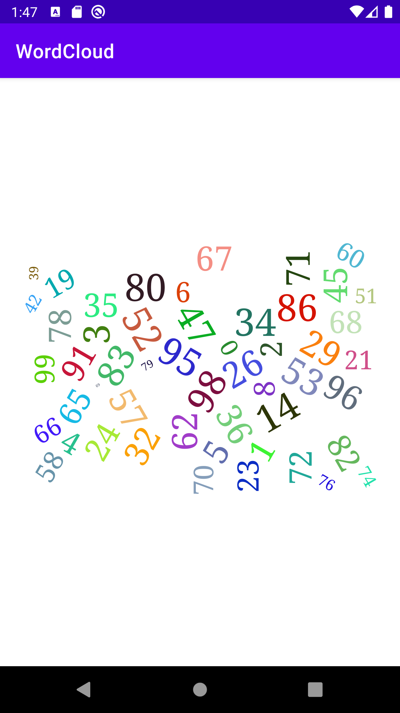
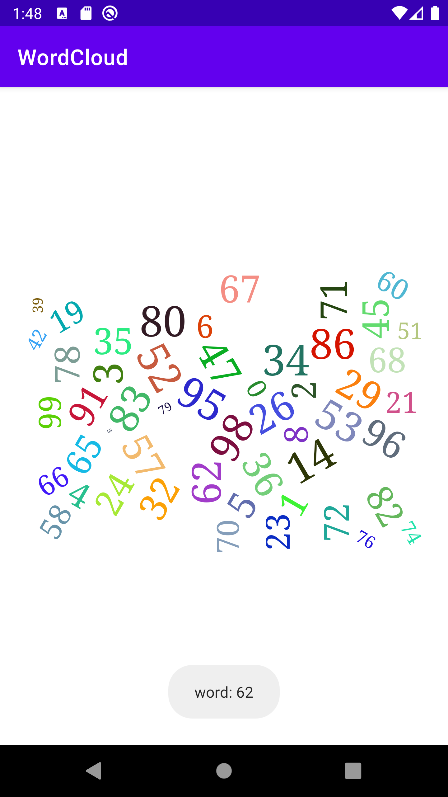

# WordCloud
Android WordCloud

| --------------------------------------- | --------------------------------------- |
|  |  |


#  사용법
root gradle repositories
```gradle
repositories {
    ...
    maven { url 'https://jitpack.io' }
}
```

app gradle dependency
```gradle
dependencies {
    implementation 'com.github.eress221:WordCloud:1.0'
}
```

view xml
layout_width, layout_height는 화면에 표시할 size
```xml
<FrameLayout
    android:layout_width="match_parent"
    android:layout_height="300dp">

    <com.eress.wordcloud.WordCloudView
        android:id="@+id/wc_view"
        android:layout_width="match_parent"
        android:layout_height="match_parent"
        android:layout_margin="10dp" />

</FrameLayout>
```

kotlin
```kotlin
// Custom WordList
val wordList = mutableListOf<Word>()
for (i in 1..100) {
    test.add(Word(Random().nextInt(100).toString(), 100-i, i))
}
val wcView = findViewById(R.id.wc_view)
wcView.setListener(object : WordCloudListener{
    override fun onPageFinished(view: WebView) {
        wcView.setDataSet(wordList)
    }

    override fun onTouch() {

    }

    override fun onWordClick(word: String) {
        Toast.makeText(applicationContext, "word: $word", Toast.LENGTH_SHORT).show()
    }
})
```

word
```kotlin
word: String? = null
size: Int = 0
rank: Int = 0
color: String? = null

constructor(word: String, size: Int, rank: Int)
constructor(word: String, size: Int, rank: Int, color: String?)
```


# 라이브러리 및 참고자료
- [d3-wordcloud](https://github.com/wvengen/d3-wordcloud)
- [AndroidWordCloud](https://github.com/alhazmy13/AndroidWordCloud)


# License
```
MIT License

Copyright (c) 2021 eress221

Permission is hereby granted, free of charge, to any person obtaining a copy
of this software and associated documentation files (the "Software"), to deal
in the Software without restriction, including without limitation the rights
to use, copy, modify, merge, publish, distribute, sublicense, and/or sell
copies of the Software, and to permit persons to whom the Software is
furnished to do so, subject to the following conditions:

The above copyright notice and this permission notice shall be included in all
copies or substantial portions of the Software.

THE SOFTWARE IS PROVIDED "AS IS", WITHOUT WARRANTY OF ANY KIND, EXPRESS OR
IMPLIED, INCLUDING BUT NOT LIMITED TO THE WARRANTIES OF MERCHANTABILITY,
FITNESS FOR A PARTICULAR PURPOSE AND NONINFRINGEMENT. IN NO EVENT SHALL THE
AUTHORS OR COPYRIGHT HOLDERS BE LIABLE FOR ANY CLAIM, DAMAGES OR OTHER
LIABILITY, WHETHER IN AN ACTION OF CONTRACT, TORT OR OTHERWISE, ARISING FROM,
OUT OF OR IN CONNECTION WITH THE SOFTWARE OR THE USE OR OTHER DEALINGS IN THE
SOFTWARE.
```
